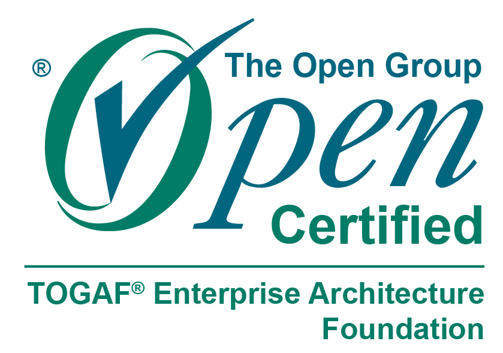

## Hi there 👋, I'm Jules

<!--
**jules-tnk/jules-tnk** is a ✨ _special_ ✨ repository because its `README.md` (this file) appears on your GitHub profile.

Here are some ideas to get you started:

- 🔭 I’m currently working on Web3 and Hedera related projects
- 🌱 I’m currently learning Enterprise Architecture and System Design
- 👯 I’m looking to collaborate on ...
- 🤔 I’m looking for help with ...
- 💬 Ask me about ...
- 📫 How to reach me: ...
- 😄 Pronouns: ...
- ⚡ Fun fact: ...
-->

<!--

&nbsp;

-->

# 💫 About Me

🔭 I’m currently working on Web3 and Hedera related projects mainly with TypeScript and other web technologies 🌱 I’m currently learning Enterprise Architecture, System Design and AI 💬 Ask me about Web Development, Web3, Architecture, AI and Programming in general

# 💻 Tech Stack

## 🖥️ Programming Languages

## 📚 Frameworks & Libraries

## 🗄️ Databases

## 🛠️ Tools & Platforms

# Certifications

  
  

