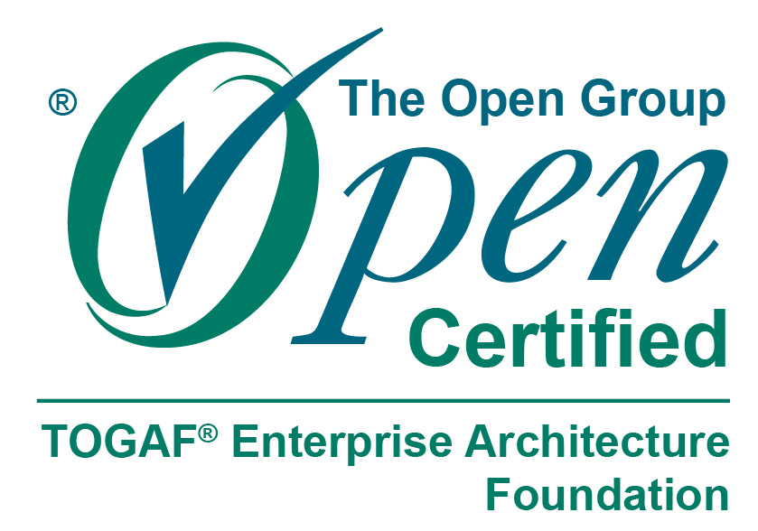

<h1 align="center">Hi, I'm Jules 👋</h1>

  <em>Full-Stack Engineer · Web3 Builder · Enterprise Architecture Practitioner</em>

## 💫 About Me

I'm **Kibalo Jules Tinaka**, a software engineer who enjoys building useful applications and designing reliable systems, from idea to real-world deployment.

### What I Do

I work across **web**, **mobile**, and **desktop** platforms, with a focus on crafting experiences that are both functional and well-architected.

My core stack (**TypeScript, Python, Java, and Flutter**) gives me the flexibility to pick the right tool for every layer of a project.

### What I'm Into

- 🌐 **Web development** : building fast, scalable, and maintainable web experiences
- 🔗 **Decentralized technologies** : exploring the potential of blockchain and distributed systems
- 🤖 **Artificial intelligence** : building AI powered apps. I am an optimistic believer in AI as a force for good

### Public Work

- **[Epura](https://github.com/jules-tnk/flutter-epura)** : A Flutter app that helps you reclaim phone storage through a swipe-based interface for reviewing and deleting recent photos, videos, and downloads.

- **[ts-http-mcp](https://github.com/jules-tnk/ts-http-mcp)** : A TypeScript MCP server that lets AI agents send HTTP requests to any endpoint, with full control over headers, query params, and request bodies.

- **[ts-mcp-hedera](https://github.com/jules-tnk/ts-mcp-hedera)** : A TypeScript MCP server that exposes Hedera blockchain operations (account management, HBAR transfers, and consensus messaging) as tools for AI assistants.

### Find Me

- 🌍 **Website:** [jules-tnk.online](https://jules-tnk.online)

## 🏆 Certifications & Badges

  &nbsp;&nbsp;
  &nbsp;&nbsp;
  &nbsp;&nbsp;
  &nbsp;&nbsp;
  &nbsp;&nbsp;
  &nbsp;&nbsp;
  &nbsp;&nbsp;

## 💻 Tech Stack

### Programming Languages

### Frameworks & Libraries

### Databases

### Tools & Platforms

