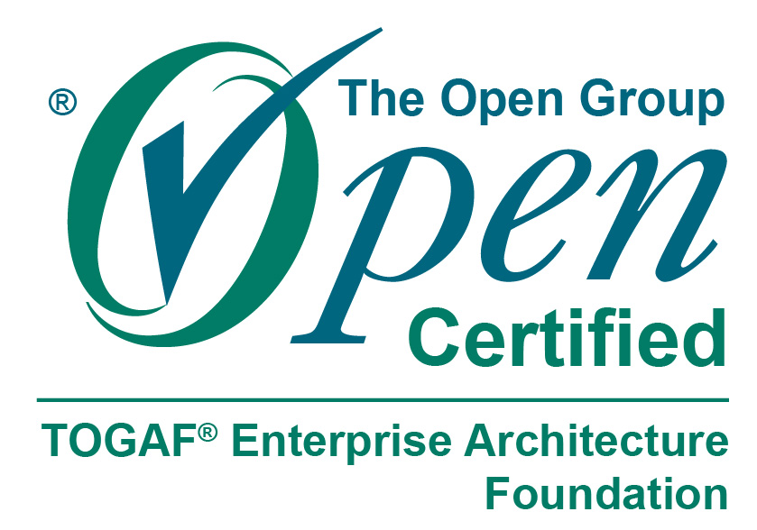

<h1 align="center">Hi, I'm Jules</h1>

  <em>Full-Stack Software Engineer · AI Systems Builder · System Architect</em>

## 💫 About Me

I'm **Kibalo Jules Tinaka**, a software engineer who builds full-stack products and AI systems, from architecture through production.

### What I Do

I work across **web**, **mobile**, and **desktop** platforms, with a focus on crafting experiences that are both functional and well-architected.

My core stack (**TypeScript, Python, Java, and Flutter**) gives me the flexibility to pick the right tool for every layer of a project.

### What I'm Into

- 🤖 **Artificial intelligence**: building AI systems, AI agents, and AI-powered products
- 🏗️ **Software & system architecture**: designing reliable systems from requirements through production
- 🌐 **Web development**: building fast, scalable, and maintainable web experiences
- ☁️ **Cloud**: deploying resilient and cost-conscious infrastructure
- 🔗 **Decentralized technologies**: exploring blockchain, digital identity, and distributed systems

### Public Work

#### App and Tools, Reday to Use

- **[Ragora](https://github.com/jules-tnk/ragora)** : A multi-tenant RAG (Retrieval-Augmented Generation) application powered by Google's Gemini File Search API.

- **[Epura](https://github.com/jules-tnk/flutter-epura)** : A Flutter app that helps you reclaim phone storage through a swipe-based interface for reviewing and deleting recent photos, videos, and downloads.

- **[Pake (Fork)](https://github.com/jules-tnk/Pake)**: Turn any webpage into a desktop app. My fork adds a desktop UI to original project that only support CLI. Original repo: [tw93/pake](https://github.com/tw93/pake).

- **[ts-http-mcp](https://github.com/jules-tnk/ts-http-mcp)** : A TypeScript MCP server that lets AI agents send HTTP requests to any endpoint, with full control over headers, query params, and request bodies.

- **[ts-mcp-hedera](https://github.com/jules-tnk/ts-mcp-hedera)** : A TypeScript MCP server that exposes Hedera blockchain operations (account management, HBAR transfers, and consensus messaging) as tools for AI agents.

#### Experimenting With New Tech

- **[hands-on-google-genui](https://github.com/jules-tnk/hands-on-google-genui)** : An experimentation on generative UI using Google's A2UI protocol.

- **[hands-on-astryx-meta](https://github.com/jules-tnk/hands-on-astryx-meta)** : A React mock SaaS demo built with Meta's Astryx design system, showcasing template-based login, AI chat, admin dashboard, and settings screens.

#### Sharing useful resources

- **[togaf-10-study-resources](https://github.com/jules-tnk/togaf-10-study-resources)** :  Study materials I used to prepare for the TOGAF 10 Foundation certification

### Find Me

- 🌍 **Website:** <a href="https://jules-tnk.com" target="_blank">jules-tnk.com</a>

- 💼 **Linkedin:** <a href="https://www.linkedin.com/in/kibalo-jules-tinaka" target="_blank">Kibalo Jules Tinaka</a>

## 🏆 Certifications & Credentials

### Professional Certifications

<table>
  <tr>
    <td align="center" width="33%">
       
      <strong>IBM Generative AI Engineering Professional Certificate</strong> 
      2026
    </td>
    <td align="center" width="33%">
       
      <strong>TOGAF Enterprise Architecture Foundation</strong> 
      2025
    </td>
    <td align="center" width="33%">
       
      <strong>Chartered Blockchain Analyst I (CBA®)</strong> 
      2023
    </td>
  </tr>
</table>

### Other Credentials

<table>
  <tr>
    <td align="center" width="33%">
      <a href="https://verify.skilljar.com/c/2fd83oit7b74">
         
        <strong>AI Fluency: Framework &amp; Foundations</strong>
      </a> 
      Anthropic Education · 2026
    </td>
    <td align="center" width="33%">
      <a href="https://verify.skilljar.com/c/uksmjhifz3q7">
         
        <strong>Model Context Protocol: Advanced Topics</strong>
      </a> 
      Anthropic Education · 2026
    </td>
    <td align="center" width="33%">
      <a href="https://verify.skilljar.com/c/w2khn68ahwtb">
         
        <strong>AI Capabilities and Limitations</strong>
      </a> 
      Anthropic Education · 2026
    </td>
  </tr>
  <tr>
    <td align="center" width="33%">
       
      <strong>AI Agents Using RAG and LangChain</strong> 
      2026
    </td>
    <td align="center" width="33%">
       
      <strong>Generative AI Advanced Fine-Tuning for LLMs</strong> 
      2026
    </td>
    <td align="center" width="33%">
       
      <strong>Generative AI and LLMs: Architecture and Data Preparation</strong> 
      2026
    </td>
  </tr>
  <tr>
    <td align="center" width="33%">
       
      <strong>Generative AI Applications Specialist</strong> 
      2026
    </td>
    <td align="center" width="33%">
       
      <strong>Generative AI Engineering with Transformers &amp; LLMs</strong> 
      2026
    </td>
    <td align="center" width="33%">
       
      <strong>Generative AI Language Modeling with Transformers</strong> 
      2026
    </td>
  </tr>
  <tr>
    <td align="center" width="33%">
       
      <strong>Web Development with HTML, CSS, JavaScript Essentials</strong> 
      2022
    </td>
    <td align="center" width="33%">
       
      <strong>Python Project for Data Science</strong> 
      2022
    </td>
    <td align="center" width="33%">
       
      <strong>Python for Data Science and AI</strong> 
      2022
    </td>
  </tr>
  <tr>
    <td align="center" width="33%">
       
      <strong>Introduction to Cloud Computing</strong> 
      2022
    </td>
    <td align="center" width="33%">
       
      <strong>Databases and SQL for Data Science</strong> 
      2022
    </td>
    <td align="center" width="33%">
       
      <strong>Data Analysis with Python</strong> 
      2022
    </td>
  </tr>
  <tr>
    <td align="center" width="33%">
       
      <strong>Data Science Methodology</strong> 
      2022
    </td>
    <td align="center" width="33%">
       
      <strong>Data Science Orientation</strong> 
      2022
    </td>
    <td align="center" width="33%">
       
      <strong>Tools for Data Science</strong> 
      2022
    </td>
  </tr>
</table>

## 💻 Tech Stack

### Languages & Web

  
  
  
  
  
  
  
  

### Frameworks & Platforms

  
  
  
  
  
  
  
  
  
  

### AI & Agent Systems

  
  
  
  
  
  
  
  
  
  

### Databases

  
  
  
  

### Web3 & Digital Identity

  
  
  
  

### Cloud & Delivery

  
  
  
  
  
  

